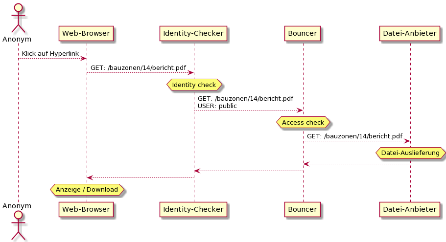
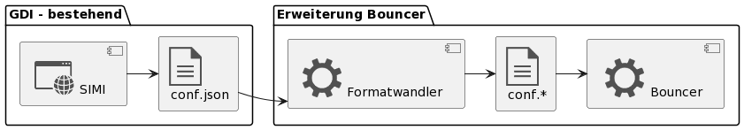
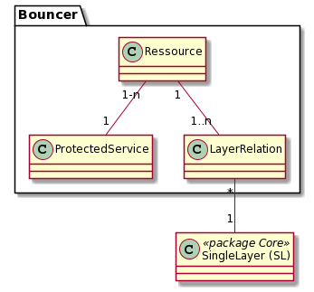

# Access-Management für die Geodaten

Neben den 95% öffentlichen Daten sind 5% der Geodaten aufgrund des Datenschutzes nicht allgemein verfügbar. Für diese
muss eine Lösung gefunden werden, um sie im Minimum per HTTPS zugriffsgeschützt beziehen zu können (herunterladen).

Aufgrund der Ähnlichkeit der Anforderungen müssen in der Lösungsfindung neben den Geodaten auch alle weiteren statischen
und dynamischen Daten der GDI berücksichtigt werden:
* Zu einem Geodaten-Objekt gehörende Berichte. Zum Beispiel ein Gutachten, welches zur Ausscheidung einer Gewässerschutzzone führte.
  Meist als pdf vorliegend.
* Dynamisch erzeugte pdf's zu einem Geodatenobjekt. Zum Beispiel ein Report zu einem unter Denkmalschutz stehenden
  Gebäude mit Text und Bildern. Der Report wird bei jedem Aufruf neu durch eine Reporting-Engine generiert.
  
Die für den Zugriffsschutz zu erstellende / konfigurierende Komponente wird fortan Bouncer (= Türsteher) genannt.
  
## Anforderungen rund um den "Bouncer"

* Die Konfiguration der Zugriffsrechte ...
  * wird vom Sachbearbeiter (AGI) in der Fachapplikation SIMI vorgenommen
  * wird auf Knopfdruck vom Sachbearbeiter auf der Integrationsumgebung publiziert
  * wird im Rahmen des "Layer-Rollout" auf Knopfdruck auf der Produktivumgebung publiziert
  * wird von SIMI in der Form einer Json-Konfigurationsdatei für den Access-Checker zur Verfügung gestellt.   
    Das Json kann entweder direkt vom Access-Checker "nativ" eingelesen werden, oder es wird mit einer zusätzlichen
    Softwarekomponente in die native Konfigurationsform des Access-Checker umgewandelt.
  * enthält den Benutzer "public". Für diesen wird explizit durchkonfiguriert, auf welche Ressoucen anonym zugegriffen
    werden darf.
* Der Bouncer
  * Erteilt oder blockiert lesenden Zugriff auf Ressourcen. Ressourcen können sein:
    * Effektiv in der Datenablage vorhandene Dateien
    * "Virtuelle Dateien" (Diese werden beim Aufruf dynamisch erzeugt und liegen nicht in der Datenablage)
    * Gruppen (Verzeichnisse) von effektiven und virtuellen Dateien. Die Zugriffskonfiguration gilt dann für alle
      enthaltenen Untergruppen und Dateien.
    * Definiert klare Regeln, welche Zugriffskonfiguration "gewinnt", sofern sowohl für ein Überverzeichnis wie auch für
      enthaltene Unterverzeichnisse / Dateien Zugriffsregeln definiert sind.
  * Unterstützt HTTP(S)
  * Unterstützt nach Möglichkeit neben HTTPS auch:
    * (S)FTP(S)
    * S3 REST API Calls
        
### Erläuternde Grafiken zu den Anforderungen

**Ablauf eines gewährten Lesezugriffs:**

Access check: Prüft im Beispiel, ob der Benutzer "public" die Ressource /bauzonen/14/bericht.pdf lesen darf.
In der Konfiguration ist dem Benutzer Zugriff auf /bauzonen und alles Enthaltene gewährt --> Bouncer holt Datei
mittels Request auf den Dateianbieter ab. 

**Erläuterung zur Konfiguration des Bouncer:**

# \[ENTWURF\] Reverse-Proxy (Bouncer)

Prüft für eine angeforderte Ressource, ob der Benutzer diese anfordern (lesen) darf. Uebersetzt den HTTP-GET Aufruf
an den Bouncer in den HTTP-GET Aufruf der mittels Bouncer geschützten Ressource des "background" Service.

Die URL für den Aufruf eines Background-Service via Bouncer setzt sich wie folgend beschrieben zusammen.

http://\[Bouncer BaseURL\]/\[ProtectedService\]/\[Ressource\]\[...\]. \[...\] sind beliebige weitere URL-Teile, 
die einfach hinten angehängt werden.

Beispiel: http://geo.so.ch/bouncer/dox42/naturreservate\[...\] 

Metamodell für die Bouncer-Konfiguration:

Beziehungen Ressource - SingleLayer:
* contains data: Beschreibt, aus welchen Ebenen eine Ressource Daten bezieht
* display in feature info: Beschreibt, in welchen Ebenen die Ressource im FeatureInfo-Dialog des Web GIS Client zum Öffnen angeboten wird.

## Klassenbeschreibung

### ProtectedService

Service (des Servers), dessen Ressourcen via Bouncer geschützt werden. Beispielsweise "Jasper Server"

#### Attribute

|Name|Typ|Z|Beschreibung|
|---|---|---|---|
|UrlTemplate|String(1000)|j|Template der URL des geschützten Service. In diese wird an der mittels Wildcard gekennzeichneten Stelle das UrlSnipplet der Ressource eingefügt.|
|Name|String(100)|j|Sprechender Name für die Ressource.|
|Description|String|n|AGI-Interne Beschreibung zur Ressource.|

### Ressource

Die Ressource, welche mit den Daten aus 1-n SingleLayern erzeugt wird. Typisches Beispiel ist ein Report, welcher
Daten in der Form von Tabellen / Karten / etc. ausgibt.

#### Attribute

|Name|Typ|Z|Beschreibung|
|---|---|---|---|
|UrlSnipplet|String(100)|j|Schnipsel, welches vom Bouncer in das URL-Template des BackgroundService eingefügt wird, um die Ressource mittels HTTP anzufordern.|
|Name|String(100)|j|Sprechender Name für die Ressource. Muss ohne encoding als Unterpfad einer URL verwendet werden können. Sprich name = urlencode(name).|
|Description|String|n|AGI-Interne Beschreibung zur Ressource.|