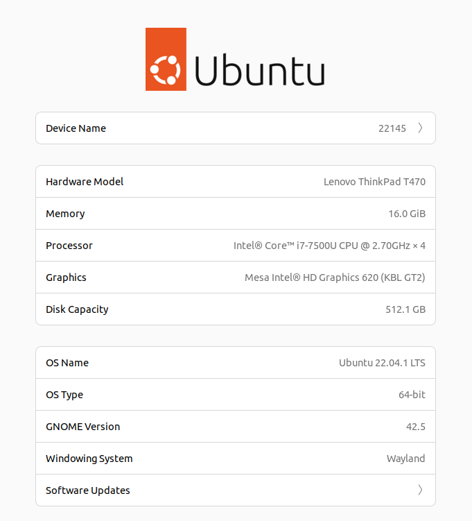

# Test versch. Transfer-Varianten bei grossern Datensätzen

Testumgebung: DB und GRETL jeweils in Docker auf meinem Notebook (alles lokal)

## Transferzeiten in Sekunden

|Variante|Anzahl Objekte|Export|Import|Total|
|---|---|---|---|---|
|XTF|300'000|10|300|310|
|Db2Db|300'000|-|-|30|
|CSV|300'000|30|4|34|
|Shp|300'000|>600|Abbruch|Abbruch|
|Db2Db|6'000'000|-|-|700|

Shp mit sechs Millionen Zeilen nicht ausprobiert, da schon mit 300'000 langsam. 
CSV zwar sehr schnell, führt aber gleich wie XTF zum Fehler java.lang.OutOfMemoryError - "GC overhead limit exceeded"

# Aufrufe

## Schema

./start-gretl.sh --docker-image sogis/gretl:latest --docker-network host --topic-name afu_igel --schema-dirname schema_pub createSchema configureSchema 

Erstellen Schema für Shapefie via ddl.sql

## Jobs

### Xtf und Db2Db

./start-gretl.sh --docker-image sogis/gretl:latest --docker-network host --job-directory $PWD/../agi/xtf_load/xtf_db

### Shp

./start-gretl.sh --docker-image sogis/gretl:latest --docker-network host --job-directory $PWD/../agi/xtf_load/shp

